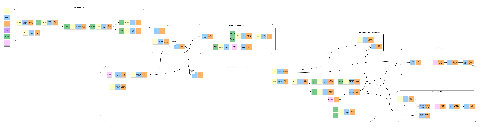
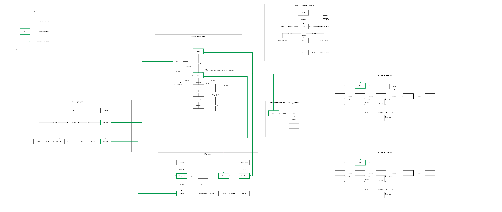
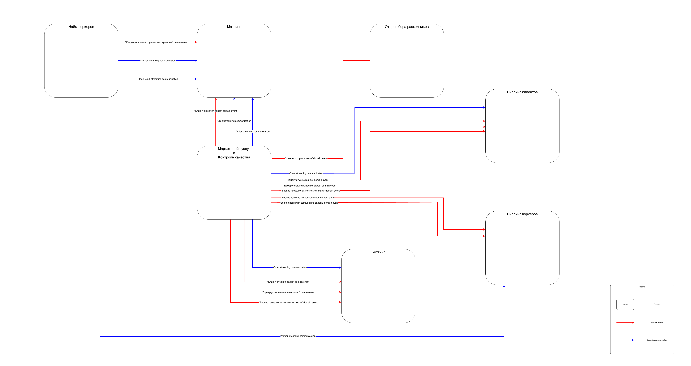
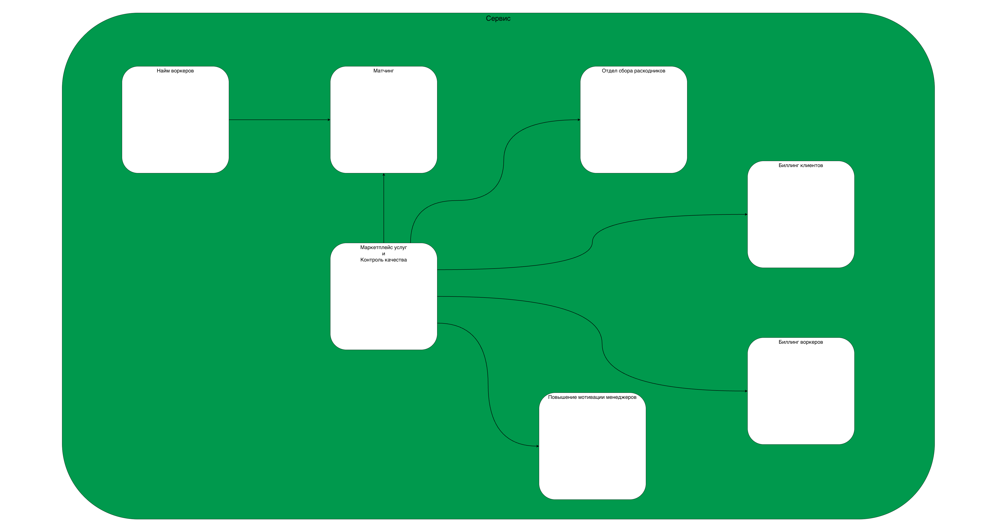

# Домашка 1 недели

Извините, что без мемов.  
Дедлайн просрочен-с.

## Event Storming

> Сделайте event storming модель проекта.

Вот:

> Текстом опишите логику, по которой сгруппировали команды и события в контексты.

- Контекст **Найм воркеров**  
  Это контекст, который отвечает за процессы, связанные с вакансиями на новых воркеров, а также с проведением тестирования кандидатов.  
  Менеджеры, которые хотят как-то менять процесс тестирования, работают над этими задачами в рамках этого контекста.  
  По результатам тестирования кандидат либо апрувится и промоутится до воркера, либо отбраковывается.  
  Кандидаты, успешно прошедшие тестирование, попадают в общий пул воркеров - которым владеет контекст **Матчинга**, т.к. именно там расчитываются характеристики воркеров (*обычных образцов*) для последующего матчинга с клиентом (*эталонным образцом*).  

- Контекст **Матчинг**  
  Из требований мы знаем, что в этом контексте свой "доменный язык" (*эталонные образцы* и *обычные образцы*), и вообще им занимается отдельная команда.  
  Поэтому я не стал смешивать его ни с контекстом **Найма воркеров**, ни с контекстом **Маркетплейса услуг**.  
  В требованиях указано, что матчинг реализован в виде отдельных шагов, которые можно комбинироваить - поэтому я добавил команду и событие по конфигурации алгоритма матчинга менеджером.

- Контекст **Маркетплейс услуг и Контроль качества**  
  Это контекст в котором клиенты (тестировщики из Happy Cat Box) могут заказать услугу у воркера.  
  Поэтому я отметил что клиенты попадают из HCB именно в этот контекст.  
  Вообще, к этому контексту у меня много вопросов.  

  - Он как будто состоит из двух частей - сам "магазин" услуг, в котором можно что-то выбрать и увидеть примерную стоимость, и та часть, в которой воркер непосредственно выполнеяет услугу. Очень долго сомневался, стоит ли разделять эти две части - но по итогу решил, что не вижу для этого достаточных оснований. Не исключаю, что это ошибка.

  - Меня очень беспокоит вопрос, где и как должен происходить расчет стоимости выполнения услуги.

    - Во-первых, он может происходить только после матчинга (**[US-050]**). Означает ли это что матчинг должен вызываться синхронно в процессе оформления заказа?  
    - Во-вторых, верно ли, что расчитывает сам контекст **Маркетплейса**? Не должен ли это делать контекст **Биллинг клиентов**? Пока склоняюсь что все-таки **Маркетплейс**, т.к. наверняка логика ближе к нему, особенно если придут менеджеры ее менять.
    - В-третьих, как это показать на Event Storming? С какой-то точки зрения, можно было бы сказать, что матчинг (как процесс) - это технический шаг команды *"Оформить заказ"*, как и расчет стоимости. Тогда вроде всё просто на модели, но мы внезапно теряем "стрелку" (т.е. связь) на модели ES, но этого почему-то не хочется - вроде как связь по поведению между контекстами ведь есть, значит ее лучше отразить, чем нет.

- Контекст **Отдел сбора расходников**  
  Его уведомляет контекст **Маркетплейса** о факте оформления нового заказа.  
  Предполагаю, что в доменном событии *"Заказ оформлен"* мы могли бы передать сразу всю необходимую информацию для сбора расходников:
  - Клиента (для заказа печеньки)
  - Воркера
  - Заказанной услуги (чтобы знать что собирать для воркера)

- Контекст **Повышение мотивации менеджеров**  
  Это контекст, в котором менеджеры могут делать ставки на выполнение заказов (тотализатор).  
  Контекст должен ловить доменные события от контекста, где воркеры выполняют заказы, и расчитывать выигрыш.

- Контекст **Биллинг клиентов**  
  Тут ведется только учёт фактически совершенных транзакций, и баланс клиента.  
  Здесь по таймеру выставляются инвойсы, и оплачиваются через выбранную платежную систему клиентом.
  Видимо также в этом же контексте после совершения оплаты может пересчитаться доступная скидка клиенту.

- Контекст **Биллинг воркеров**  
  Тут ведется учёт совершенных транзакций для воркеров - начисление оплаты за выполненные услуги, начисление штрафов за проваленные услуги.  
  Здесь я добавил отдельную команду для менеджеров чтобы вручную пополнить баланс воркера (выписать премию).  
  Я отделил два контекста биллинга, т.к. они как будто следуют разным требованиям, и вполне могут различаться гораздо сильнее, чем видно на первый взгляд (более сложные скидки и программы лояльности для клиентов, и какая-то еще своя логика для воркеров).

## Модель данных

> Сделайте модель данных для требуемой системы.

Вот:

## Общая модель всех коммуникаций в системе

> Сделайте общую модель всех полученных коммуникаций в системе.

Вот:

## Структура системы

> Выберите подходящую реализацию проекта (монолит или сервисы, как элементы системы связаны между собой).

Вот:

> Текстом опишите, почему была выбрана именно такая структура, какие варианты рассматривались и по каким причинам было выбрано итоговое решение.

На текущий момент, мы знаем только о требовании обеспечить низкий TTM - т.е. нужно уметь быстро доставлять фичи на прод.  

По материалу, описанному в уроке, кажется, что микросервисы дороже как минимум с точки зрения изначальной реализации (т.е. мы потратим больше времени на старте проекта на то, чтобы написать все отдельные сервисы, настроить мониторинги, управлять всеми 6-7-8 базами данных, итд).  

Поэтому на текущем этапе начнем с монолита.  
Чтобы отделить логику разных контекстов друг от друга (например, **Найма** и **Матчинга**), и чтобы всё не скатилось в Big ball of mud, попробуем ограничить взаимодействие контекстом только через публичный API, минизируем шаринг данных через БД.

## Спорные места

> Опишите спорные места и (или) места, которые вам кажутся критичными на данный момент.

- Как передавать данные между контекстами **Найма** и **Матчинга**?  
  Пока что я обозначил и коммуникацию через доменное событие, и стриминг данных.  
  Вообще говоря, кажется что это ошибка - скорее всего мы сможем передать все данные для **Матчинга** прямо в событии *"Кандидат успешно прошел тестирование"*, и отдельного стриминга на уровне модели данных не понадобится.  
  Если это так, то диаграмма модели данных может упроститься (и минус две коммуникации в системе).  
  Но надо ли в таком случае как-то в отдельно обозначить передачу данных о новом в воркере в контекст **Биллинг воркеров**? Сейчас у меня это тоже изображено как стриминг. Стоит заменить на доменное событие?

- Очень спорное место - расчет стоимости заказа в контексте **Маркетплейс услуг**. Очень хочется узнать, как это делать по-нормальному.

# Cпасибо за внимание!
