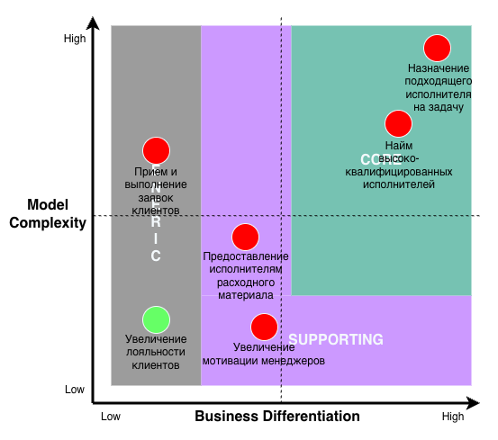
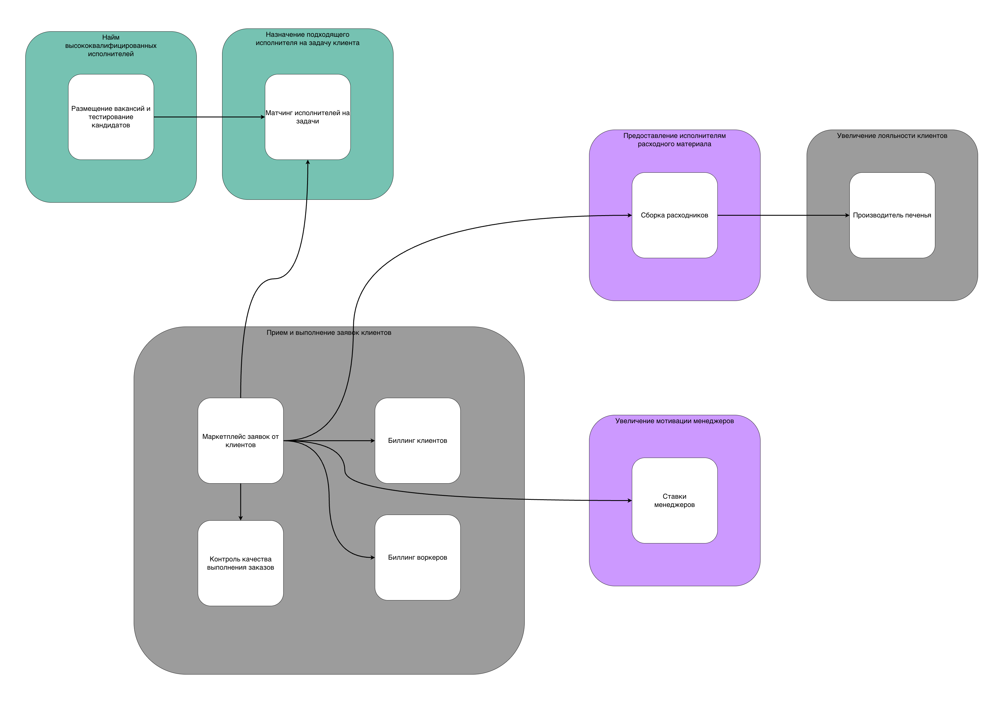
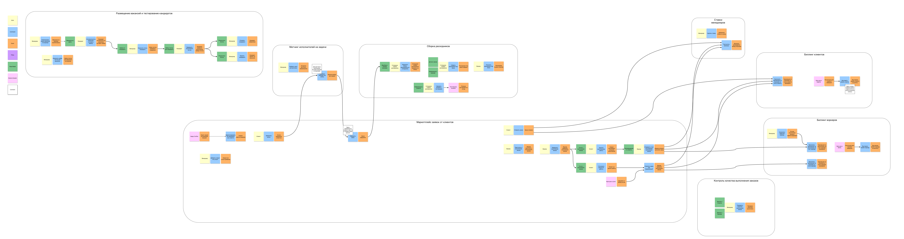
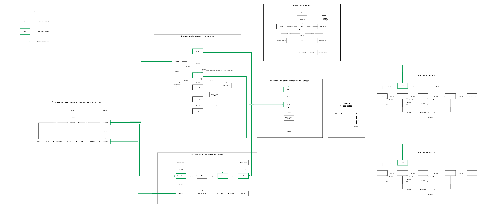
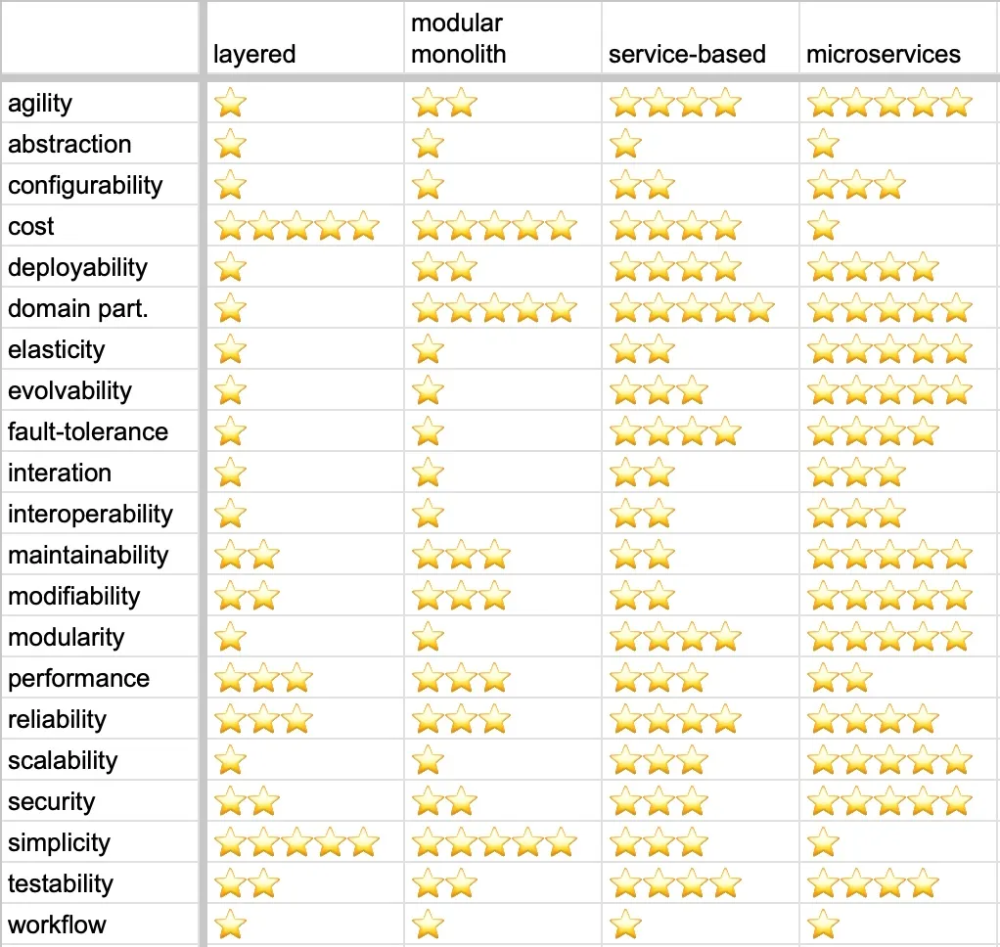
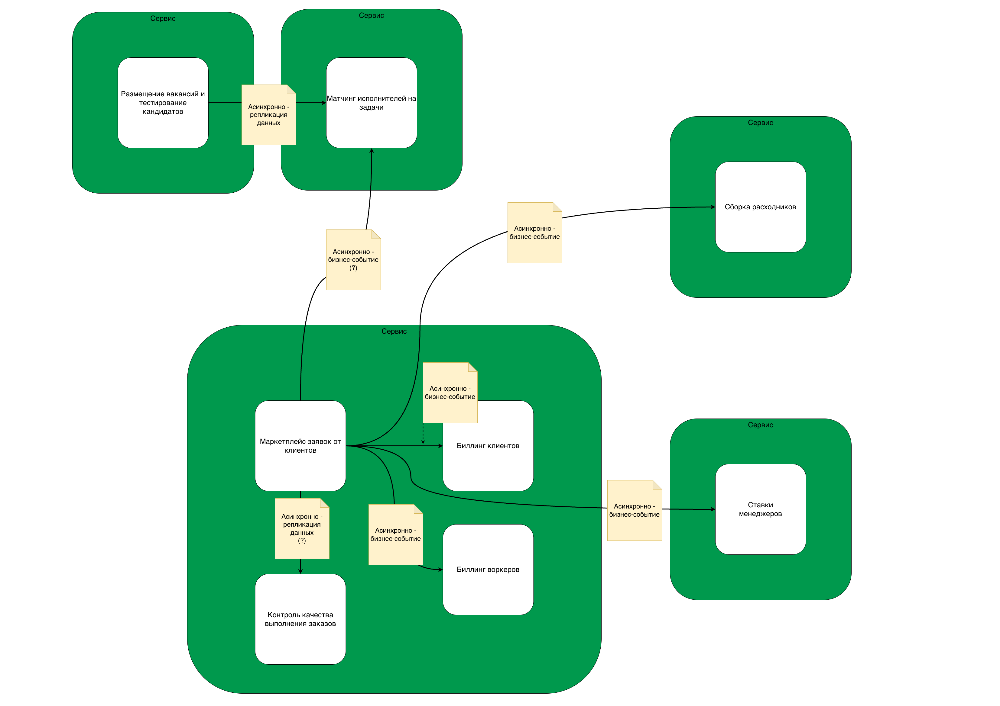

# Домашка 2 недели

Мем в конце ))  
Не зря же я всё это печатал...  Ведь не зря?  

## Поддомены

> - выпишите все поддомены, которые вы нашли в системе;  
>   - текстом опишите логику, по которой были выбраны поддомены;

Основная (глобальная) цель компании:  
Решить проблему усталости котов-тестировщиков HCB посредством делегирования их рутинных задач на топ-3% талантов среди котов.

Какие я здесь вижу под-проблемы (и соответствующие поддомены):

- Надо нанять воркеров, причем это должны быть топ-3% соискателей
  - Поддомен **"Найм высококвалифицированных исполнителей"**
- Надо идеально подобрать кота-воркера под задачу кота-клиента
  - Поддомен **"Назначение подходящего исполнителя на задачу клиента"**
- Надо принять от котов-клиентов заявки на выполнение какой-то услуги и выполнить её, получив за это деньги
  - Поддомен **"Прием и выполнение заявок клиентов"**
- Надо убедиться, что у воркера есть всё необходимое для выполнения любой задачи клиента
  - Поддомен **"Предоставление исполнителям расходного материала"**
- Проблема увеличения лояльности клиентов
  - Поддомен **"Увеличение лояльности клиентов"**
- Проблема увеличения мотивации менеджеров
  - Поддомен **"Увеличение мотивации менеджеров"**

Не стал выделять отдельные под-домены финансовых взаиморасчетов, или контроля качества.  
Не похоже, чтобы они решали какую-то отдельную проблему бизнеса согласно нашим требованиям:

- контроль качества нужен только для того, чтобы лучше выполнять заказы (если б не было заказов - не было бы и проблемы).
- оплата тоже нужна только для заказов.

С другой стороны, хоть на отдельную "подпроблему" бизнеса они не тянут - но оба они похожи на "под-задачу" в подпроблеме "Прием и выполнение заявок клиентов".  
И если рассматривать подпроблемы (поддомены) как стратегический аспект бизнеса (что нам нужно сделать чтобы добиться главной цели компании), то такие "подзадачи" - это тактический аспект (как мы будем решать одну из наших подпроблем, определенных в нашей стратегии).  
А значит, их стоит рассматривать как Bounded Contexts внутри поддомена "Прием и выполнение заявок клиентов".

### Биллинги

На мой взгляд - подзадачи "сбор оплаты за заказы" или "начисления зарплаты" - довольно спорное место.  
Я думаю, что в других условиях вполне реально, что "оплата"/"биллинг" станет отдельным поддоменом для какой-то другой компании (например, основным продуктом у компании и является этот самый "биллинг").  

По нашим требованиям выходит так, что биллинг это не основной продукт компании, т.е. скорее всего он здесь нужен достаточно типовой.  
Т.е., вероятно, его можно было бы заменить на готовое решение.  
И в таком случае, мне кажется, что возможен один из двух вариантов:  

- Т.к. "оплата заказов" - это типовая задача для "магазина", то можно заменять на готовое решение весь "магазин", в котором будем заводить наши услуги, а клиенты будут им пользоваться для того, чтобы что-то покупать (а-ля Shopify). Т.е. в таком случае мы заиспользуем готовое решение целиком для всего поддомена "Прием и выполнение заявок клиентов".
- Если заменять весь "магазин" целиком не хочется, то получится так, что мы часть реализуем сами (например, свой магазин + трекинг выполнения заказов), и нам нужно будет только решить подзадачу "проведи оплату", для чего можно заинтегрировать какой-нибудь Stripe. Но этот же вариант, скорее всего, будет означать, что Bounded Context для оплаты у нас все равно будет, т.к. Stripе даст только "сбор денег с карты", а всю логику мерчанта, скорее всего, мы напишем сами.  

### Матчинг

Почему "Назначение подходящего исполнителя на задачу клиента" это отдельный поддомен для нас:

- Согласно требованиям, наша компания сюда усиленно вкладывается, применяет самые передовые технологии (map-reduce!), т.е. позиционирует это как конкурентное преимущество компании
- Разработчики очень хотят "огородиться от внешнего мира", сами писать алгоритмы на чем хотят, говорят на своём языке (т.е. придумали свои термины для сущностей, которые в других частях компании уже имеют другое название).

В итоге, получается:  

- Если бы не "конкурентное преимущество", то можно было бы шаг матчинга вообще рассматривать как часть поддомена "прием и выполнение заявок" (например, если бы алгоритм был просто по первому свободному воркеру).  
- А для того, чтобы у нас UL был "однозначен", лучше чтобы это был еще и отдельный Bounded Context.  

Применив здесь правило буравчика "1 поддомен == 1 bounded context", лучше прикинуть что это отдельный поддомен со своим bounded context.

## Типы поддоменов

> - определите все типы поддоменов и заполните core domain chart;
>   - опишите логику, по которой был выбран тот или иной тип поддомена (можно повторить таблицу из урока);

Core Domain Chart:

| Поддомен | Конкурентное преимущество | Сложность | Изменчивость | Варианты реализации | Интерес проблемы | Предполагаемый вид |
| -------- | ------------------------- | --------- | ------------ | ------------------- | ---------------- | ------------------ |
| Найм высококвалифицированных исполнителей | да | высокая | частая | инхаус | высокий | core |
| Назначение подходящего исполнителя на задачу клиента | да | высокая | частая | инхаус | высокий | core |
| Прием и выполнение заявок клиентов | нет | средняя | редкая | инхаус | низкий | generic |
| Предоставление исполнителям расходного материала | нет | низкая | редкая | инхаус | низкий | supporting |
| Увеличение лояльности клиентов | нет | низкая | редкая | аутсорс | низкий | generic |
| Увеличение мотивации менеджеров | нет | низкая | редкая | инхаус | низкий | supporing |

- Поддомены "Найм высококвалифицированных исполнителей" и "Назначение подходящего исполнителя на задачу клиента" - core, потому что согласно требованиям, это те области, которые наша компания декларирует как конкурентное преимущество, и вкладывает больше всего усилий.
- "Прием и выполнение заявок клиентов" - generic, потому что представляет собой одинаковую для многих компаний проблему.
- "Предоставление исполнителям расходного материала" - решил что это supporting, потому что "помогает бизнесу, но не представляет уникальной ценности".
- "Увеличение лояльности клиентов" - generic, т.к. мы точно это решение покупаем (печеньки).
- "Увеличение мотивации менеджеров" - supporting. Кажется, что это могли сделать на коленке мы сами (может, сходу готового на рынке не нашлось, или было слишком дорого для такого рода проекта), но уникальной ценности нет.

## Bounded Contexts

> определите боундед-контексты для каждого из поддоменов, основываясь на требованиях;

> сравните полученные боундед-контексты из поддоменов и боундед-контексты, полученные из ES. Опишите, что разошлось и предположения, почему так получилось;

- Основное отличие - bounded context "Контроль качества выполнения заказов".
По анализу ES, я оставил "Контроль качества" в одном контексте с "Маркетплейсом услуг", потому что не увидел причин для того, чтобы их разделять, с точки зрения поведения или данных.  
Но если смотреть с точки зрения "bounded context - это то, из чего будет состоять решение подпроблемы бизнеса", то "Контроль качества" действительно выглядит, как отдельная "подзадача".  
- По материалам второго урока стало более понятно, что меня беспокоило в контексте "Маркетплейс услуг" и почему я не стал выделять 2 отдельных контекста - один на размещение заказа пользователем, а второй на его выполнение воркером. И это - coupling.  
Если бы я разделил эти два контекста, то здесь стало бы понятно, что:
  - они оба выполняют примерно одну и ту же задачу (управление жизненным циклом заказа)
  - но если их два - они имели бы не только coupling по данным, но еще и временной coupling (один не имеет смысла без другого - пока в одном контексте не появились данные, в другом контексте не с чем работать).
- При этом с биллингами идти таким же путем (объединение с контекстом создания/жизни заказа) нельзя - иначе контекст станет слишком неоднозначным (может проявиться неоднозначность языка, если вдруг пресловутые "Транзакции" или "Аккаунты" всплывут с двумя значениями).

> сделайте исправленную версию ES-модели и модели данных, если боундед-контексты разошлись. Если не разошлись — приложите ES и модель данных из прошлого урока;

Event Storming:  

Data Model:

## Характеристики

> Выпишите характеристики, важные для проекта. В нашем случае мы не можем спросить у бизнеса, что важно, а что нет;  
> Для каждой найденной характеристики укажите место, где она была взята;

- **agility**, **testability**, **deployability**. Взято из требования к минимальному ТТМ для выкатки новых фич.
- **availability**, **testability**, **modifiability**, **maintainability**, **extensibility**. Взято из специфики core-поддоменов + поддоменов, реализующих конкурентное преимущество.
- **maintainability** - критично для supporting и generic поддоменов.

> выберите один из четырёх архитектурных стилей, описанных в уроке. Опишите, почему вы сделали такой выбор и по каким характеристикам сравнивали стили (можно использовать картинку из урока со сравнением стилей);

Согласно табличке, архитектурный стиль, который наибольшим образом удовлетворяет перечисленным выше характеристикам - это **микросервисы**.  
Я думаю, что наибольший упор стоит сделать именно на характеристиках **modifiability**, **maintainability** - для того, чтобы у бизнеса была максимальная свобода в отсеве и тестировании гипотез, особенно в core-поддоменах.

## Итоговая модель

> сделайте итоговую модель системы, укажите виды коммуникаций между элементами, если выбрали распределённый стиль.

Я выбрал асинхронные коммуникации, просто потому что проходил курс "Коммуникации Систем" ))  
На деле, я не до конца уверен, валидно ли сделать коммуникацию между "Маркетплейсом заявок" и "Матчингом" асинхронной коммуникацией - если вдруг по требованиям окажется, что эта коммуникация должна обладать строгой консистентностью - тогда это будет синхронный запрос. Но для этого надо уточнять требования.

## Мем

Посвящается людям, с атопическим дерматитом:

