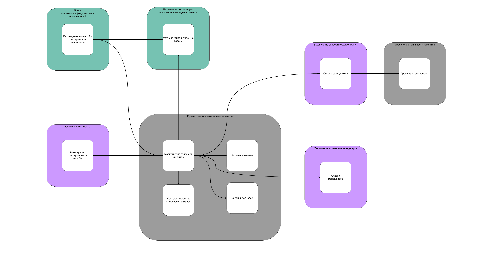
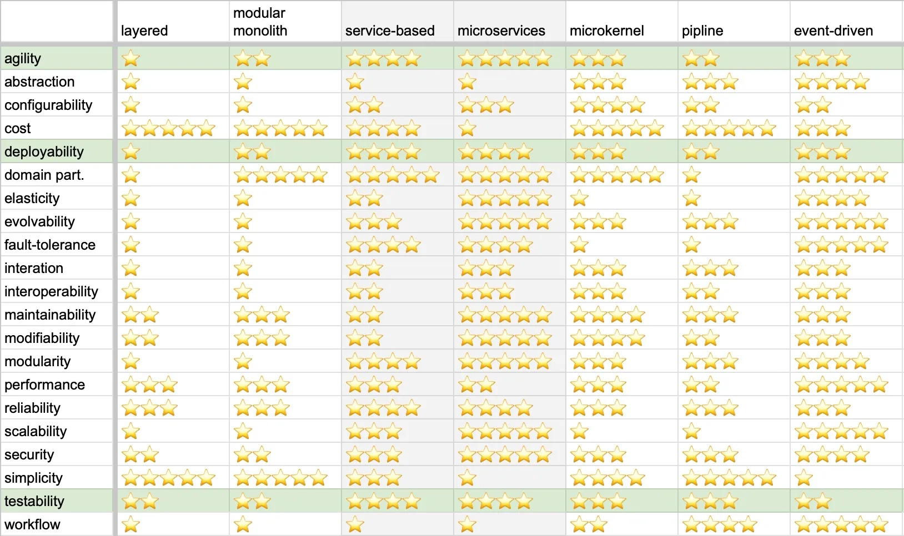
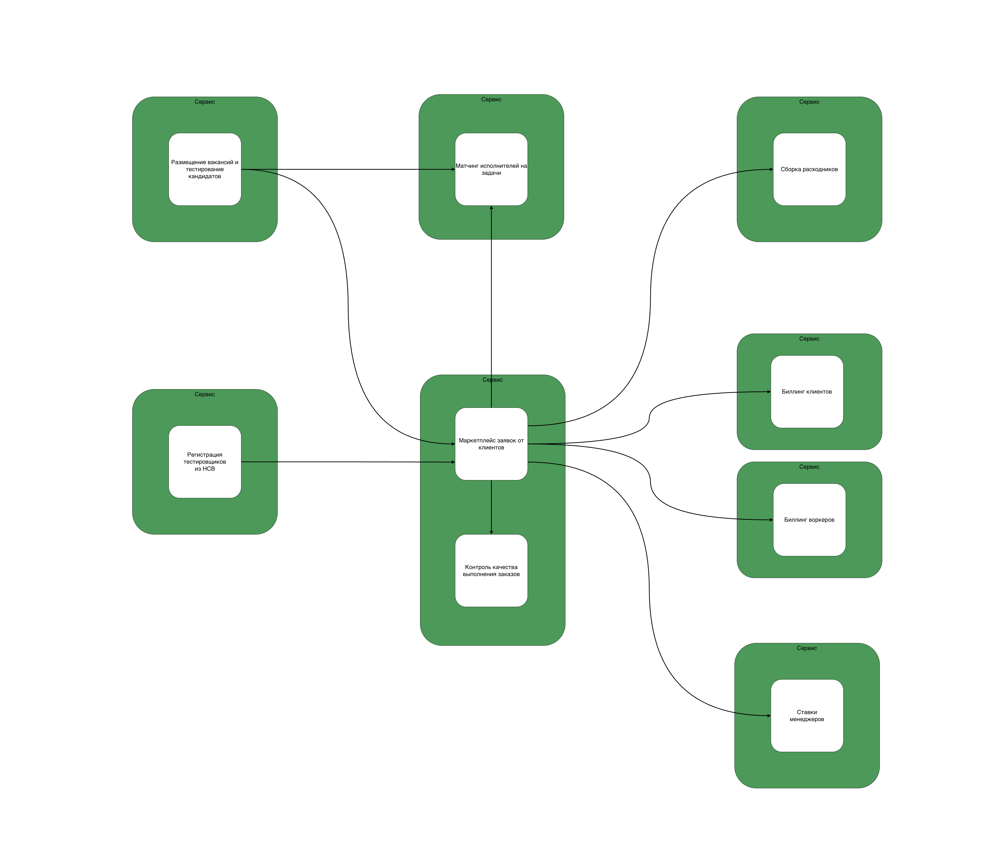
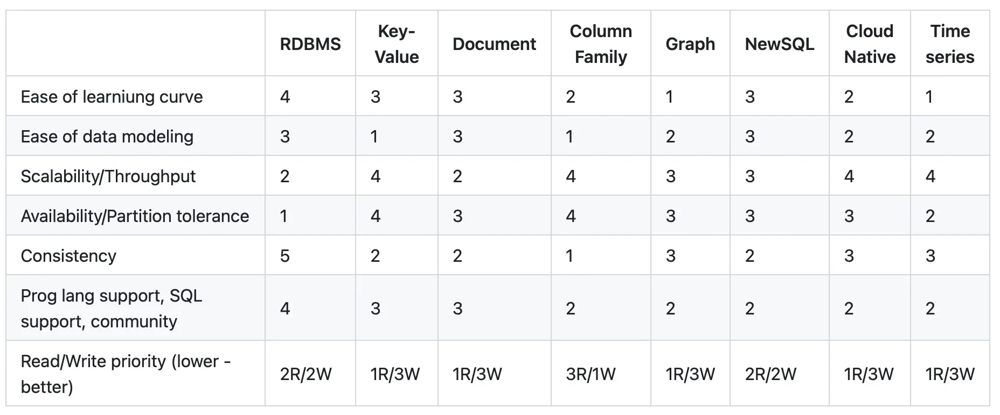
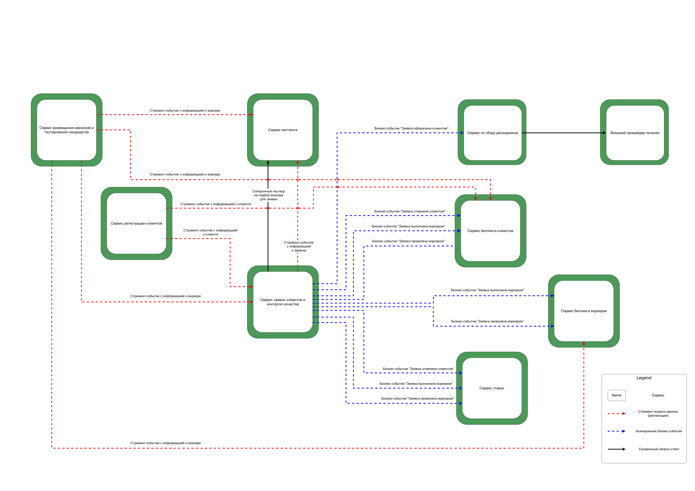

# Домашка 3 недели

Очень тупой мем в конце (вам не понравится)!  
Не пропустите!

## Консёрны стейкхолдеров  

> Попробуйте расписать стейкхолдеров по группам из урока. Попутно пофантазируете, кого потенциально мы забыли указать в списке стейкхолдеров;

| Стейкхолдеры | Консёрн | О чем вообще речь | Будем учитывать |
| -------- | ---------- | ----------------- | --------------- |
| Топ-менеджмент | скоринг потенциальных работников уникален в своём роде, и логика его работы сильно выше, чем планировалось. Бизнес в будущем хочет продавать его другим компаниям и тестировать больше гипотез; | Поддомен "поиск высококвалифицированных сотрудников" - core для бизнеса. High model complexity - важны modifiability, maintainability. | Да |
| Топ-менеджмент | релизный цикл для всей системы — месяц, для скоринга работников — неделя максимум. | Релизный цикл у bounded context "Размещение вакансий и тестирование кандидатов" отличается от остальной системы. | Да |
| Менеджеры | хотят, чтобы о системе ставок не знали другие отделы, иначе будет некрасивая ситуация. Они хотят скрыть эту систему даже от разработчиков, которые не будут ей заниматься, и от начальства; | Особые правила авторизации в bounded context "Ставки менеджеров"? | Хз, допустим. |
| Менеджеры | выяснилось, что котам из Happy Cat Box наш проект понравился, поэтому приходит не 10 заказов в день, а 10 заказов в минуту. | scalability для bounded context "Маркетплейс услуг". | Да |
| Финотдел | списывать деньги с клиентов каждую неделю слишком затратно для отдела, поэтому они хотят списывать деньги раз в месяц, но платить воркерам и дальше раз в месяц. При этом необходимо постоянно добавлять новые способы списания денег для клиентов. Воркеры всегда работают через компанию «Золотая шляпа»; | modularity для bounded context "Биллинг клиентов". | Да |
| Финотдел | боятся потерять любую финансовую информацию и хотят решение, которое будет гарантировать, что всё будет ок. | Требования к consistency для контекстов "Биллинг клиентов" и "Биллинг воркеров". | Да |
| Разработчики | система должна работать без сбоев, а если сбой случается, то должно быть понятно, что и где чинить. | Требования к fault-tolerance, maintainability, debuggability системы | Насколько получится. |
| Админы | простота мониторинга системы для своевременного замечания сбоев, чтобы не работать в авральном режиме. | Не знаю насчет характеристики monitorability, поэтому пусть будет тоже требованием к maintainability. | Да |
| Юристы | соответствие всей системы правовым нормам. | Неконкретная формулировка. Видимо, речь про ограничения по комплаенсу. | Комплаенс учитывать будем. |
| Клиенты | ожидаемое поведение системы: без сбоев и тупняков. | availability, performance. ну и в целом похоже на usability. | Ну, как пойдет. |

Из тех, кого забыли, на ум приходят сотрудники отдела расходников и, собственно, нанятые нами воркеры.

| Стейкхолдеры | Консёрн | О чем вообще речь | Будем учитывать |
| -------- | ---------- | ----------------- | --------------- |
| Воркеры | Хотим 2х валерьянки и кошачьей мяты в каждый пак расходников. | Хотят кайфовать, чо. | Если будет бюджет. |

(Специально не стал писать "сурьёзный" консёрн, чтобы не придумывать себе работу. Ограничимся условиями домашки.).

### Ограничения

- CatFinCompliance - хранение данных и мониторинг для финансовых операций

## Поддомены и bounded contexts

Картинка, чтобы напомнить структуру контекстов, с которой я работаю:

## Архитектурный стиль MCF

> Выберите один из семи архитектурных стилей, описанных в уроке. Опишите, почему вы сделали такой выбор и по каким критериям сравнивали стили (можно использовать картинку из урока со сравнением стилей).

Начнем с анализа характеристик.

Какие получились характеристики:

- **scalability**, **elasticity**, **reliability** для контекста "Размещение вакансий и тестирование кандидатов": из требования **[US-081]**.
- **scalability** для контекста "Маркетплейс услуг" - из консёрнов Менеджеров.
- high model complexity - **modifiability**, **maintainability**, **низкий каплинг** - для core-поддоменов "Поиск высококвалифицированных исполнителей" и "Назначение подходящего исполнителя на задачу клиента".
- **evolvability** для core-поддоменов "Поиск высококвалифицированных исполнителей" и "Назначение подходящего исполнителя на задачу клиента" из-за специфики (необходимость постоянно тюнить алгоритмы).
- **scalability**, **modifiability**, **maintainability**, **testability**, **agility** для всей системы - потому что система находится на этапе роста.
- **agility**, **testability**, **deployability** для всей системы - из требования к низкому ТТМ (Общие пожелания к системе).
- **релизный цикл в 1 неделю** для контекста "Размещение вакансий и тестирование кандидатов" (1 месяц на остальную систему) - из консёрнов Топ-менеджмента.
- **отдельная авторизация** для контекста ставок - из консёрнов Менеджеров.
- **modularity** для контекста "Биллинг клиентов" - из консёрнов Финотдела.
- **consistency** для обоих контекстов "Биллинг клиентов" и "Биллинг воркеров" - из консёрнов Финотдела.
- **fault-tolerance**, **maintainability**, **debuggability** для всей системы - из консёрнов Разработчиков.
- **maintainability** для всей системы - консёрн Админов.
- **availability**, **performance** для всей системы - консёрн Клиентов.

Отдельно хочется упомянуть консёрны Разработчиков и Клиентов.  
Есть подозрение, что обеспечить высокий **fault-tolerance**, **availability**, **performance** для всей системы - довольно сложно и дорого.  
Поэтому либо будем учитывать насколько возможно (не максимизируя), либо только в отдельных частях системы.

### Маппинг характеристик на bounded contexts

### Структура системы

Согласно анализу характеристик, для системы наиболее важно получить наибольшие значения в следующих характеристиках:

- **agility**, **deployability**, **testability** (ко всей системе предъявлены требования по низкому ТТМ)
- сразу несколько консёрнов отмечают характеристику **maintainability** (Админы, Разработчики, а также у многих контекстов есть требование к этой характеристике по тем или иным причинам)

В связи с этим, выглядит так, что монолитный стиль для всей системы в целом не подходит - у них низкие показатели agility, deployability, testability.  
Поэтому дальнейший выбор надо делать из распределённых стилей - сервисный или микросервисный стиль.

Микросервисный выглядит предпочтительнее из-за более высокого показателя maintainability.

### Разделяем сервисы сервисов

> Если выбрали распределённый архитектурный стиль, опишите, какие сервисы будут отдельно, и объясните, почему каждый из сервисов должен быть отдельно от остальных.

- Контекст "Размещение вакансий и тестирование кандидатов" должен быть вынесен в отдельный сервис, т.к. обладает уникальными характеристиками:
  - укороченный релизный цикл (1 неделя против 1 месяца для остальной системы)
  - особые требования к reliability, scalability, elasticity (нас могут ДДоСить конкуренты)
  - нужен низкий coupling, т.к. это core-поддомен
  - архитектурный стиль сервиса: я бы здесь рассмотрел ports and adapters, хотя его в табличке в уроке нету.

- Контекст "Матчинг исполнителей на задачи" также выносим в отдельный сервис:
  - core-поддомен, здесь будут проверяться основные гипотезы бизнеса, есть требования к evolvability, modifiability, низкий coupling
  - при этом нет таких жестких требований по релизному циклу
  - архитектурный стиль сервиса: Похоже, что стоит взять стиль pipeline, т.к. есть требования к гибкой настройки процесса матчинга из готовых шагов.

- Контекст "Сборка расходников" - в отдельном сервисе, потому что:
  - Относится к отдельной "проблеме" бизнеса, т.е. этим может заниматься определенная группа менеджеров (с определенными требованиями)
  - Относится к generic-поддомену, т.е. возможно когда-нибудь мы переиспользуем готовое стороннее решение.
  - архитектурный стиль сервиса: layered monolith

- Контекст "Ставки менеджеров" - в отдельном сервисе, потому что:
  - Решает отдельную "проблему" бизнеса (т.е. относится к своему поддомену)
  - Имеет отдельные требования к security. Хотя, конечно, каким образом скрыть целый сервис ото всех - я хз.
  - архитектурный стиль сервиса: layered monolith

- Контекст "Биллинг клиентов" - в отдельном сервисе:
  - Потребует отдельной изолированной БД (требование комплаенса)
  - Есть особые требования к consistency, в отличие от других контекстов (помимо контекста "Биллинга воркеров")
  - Но в отличие от "Биллинга воркеров" есть дополнительное требование к modularity - нужны плагины к разным платежным системам, и их надо постоянно добавлять
  - Как следствие, архитектурный стиль: microkernel

- Контекст "Биллинг воркеров" - в отдельном сервисе:
  - Как и "Биллинг клиентов" - должен соответствовать комплаенсу (изоляция БД) и consistency
  - Но нет требования по modularity
  - Архитектурный стиль: layered monolith

- Контексты "Маркетплейс заявок" и "Контроль качества выполнения заявок" - определил в один отдельный сервис:
  - Относятся к одному и тому же поддомену (т.е. нет противоречия по "проблемам" бизнеса)
  - Нет серьезных противоречий по остальным характеристикам (скорее, есть более избыточные характеристики у контекста "Маркетплейс", но "Контролю качества" тех же самых характеристик более чем достаточно)
  - Если отделить, то придется больше данных стримить между сервисами
  - архитектурный стиль сервиса: modular monolith

- Контекст "Регистрация тестировщиков из HCB" - наверное, самая непонятная штука.
  - В целом, его можно было бы реализовать в том же сервисе, что и "Маркетплейс услуг", т.к. для нашей компании это что-то легковесное (мы знаем, что будем своих же сотрудников сюда затаскивать).
  - С другой стороны, поддомены у них отличаются - если в какой-то момент на нашу "биржу" придут внешние клиенты, то ситуация поменяется.
  - Так что пока я выставил эту штуку отдельным сервисом (хз, даже если ошибка то не такая уж критичная как будто).
  - архитектурный стиль сервиса: layered monolith

### Итоговая структура системы

## Базы данных

> Выберите нужный вид баз данных для каждого из полученных сервисов. Если у вас получился один монолит — определите необходимый вид базы для этого монолита. Опишите, почему вы сделали такой выбор и какие критерии использовали для выбора;

Табличка из уроков с характеристиками различных видов БД:

- Контексты "Биллинг клиентов" и "Биллинг воркеров"
  - По комплаенсу - берем для каждого отдельную изолированную БД с максимальным consistency - RDBMS

- Контекст "Размещение вакансий и тестирование кандидатов"
  - Т.к. есть требования к availability / fault tolerance, то я бы рассмотрел какой-нибудь тип БД помимо RDBMS, т.к. у него самый низкий показатель Availability. Данные бизнес-логики для этого контекста - это описание вакансий, анкеты, результаты тестов. Поэтому для данного контекста я бы применил Document БД, т.к. хороший availability + хороший data modeling.

- Контекст "Матчинг исполнителей на задачи".
  - Тут я конечно фантазирую, но если предположить, что данный контекст оперирует какими-то слаботипизированными данными, то возьмем для этой задачи Graph DB. Ну и вообще, там наверное какие-то задроты сидят, им наверное "Ease of learning curve = 1" это самое оно.

- Контексты "Маркетплейс заявок от клиентов" и "Контроль качества выполнения заказов"
  - Хотя у нас и есть некоторые требования к scalability, performance в контексте "Маркетплейса", я думаю, что не менее важно здесь будет свойство Consistency. Предположу, что и соотношение R/W должно быть примерно 1:1. Поэтому возьмем обычную RDBMS (особенно учитывая что я без понятия что такое NewSQL).
  - Т.к. у нас два контекста в одном сервисе, которым нужны данные по заявкам, то они оба могут полагаться на данные в одной и той же БД (т.е. не вижу смысла делать отдельную БД для контекста "Контроль качества").

- Контекст "Регистрация тестировщиков из HCB" нам нужен, чтобы фактически стримить данные из HCB к нам.  
Не факт, что у него вообще есть своя "отдельная" БД.

- Для контекстов "Ставки Менеджеров", "Сборка расходников" - берём дефолтное, что у нас есть. Например, Managed RDBMS от cloud-провайдера.

## Коммуникации

> Выберите нужный стиль коммуникаций и их вид (синхронный/асинхронный). Опишите, почему вы сделали такой выбор и какие критерии использовали для выбора;

Коммуникация между "Маркетплейсом заявок" и "Матчингом" состоит из двух связей:

1. Синхронный request-response для запроса на подбор воркера для новой заявки клиента.  
  Эта связь синхронная, чтобы удовлетворить требование о том, что расчет цены заказа возможен только после матчинга (требование **[US-050]**).  
2. Асинхронное стриминг-событие на передачу информации о заявках.  
  Согласно требованию **[US-071]**, матчингу для работы необходима информация о заказах.  
  Т.е. для этого будем стримить заказы из "Маркетплейса".  

Я думаю, что альтернативным подходом было бы оставить синхронную связь для выполнения матчинга, а вместо стриминга заявок - использовать бизнес-события "Заявка выполнена успешно" или "Заявка провалена".

Для всех остальных коммуникаций я выбрал асинхронный event-driven стиль.
Предполагается два вида асинхронной коммуникации:

- Асинхронный стриминг объектов доменной модели (для сущностей Клиент, Воркер, Заявка);
- Асинхронные бизнес-события (в основном касательно жизненного цикла заявки клиента, от оформления до завершения / провала).

Также предполагается, что поставщик печенек - внешняя система, с которой мы можем коммуницировать только синхронному HTTP req-resp API.

Почему был выбран асинхронный event-driven стиль:

- Асинхронные коммуникации способствуют более высокому значению availability / fault tolerance, что критично в случае выхода из строя сервиса "Размещения вакансий и тестирования кандидатов", если нас все-таки за-ддосят.
- Способствуют увелчению общего scalability, elasticity, за счет меньшего числа запросов в системе, меньше параллельная нагрузка на отдельные компоненты.

## Фитнес-функции

> Предположите, какие фитнес-функции можно использовать для валидации итоговой системы. Можете считать, что система будет делаться с использованием любого языка программирования, следовательно, можете выбрать любые инструменты из любой экосистемы;

Щас конечно тоже будут фантазии и фантазии...

- Testability
  - Настроим систему статического анализа, которая будет трекать test coverage, и настроим в ней Gate на пороговое значение 90% покрытия тестами. Если покрытие меньше 90% - билд валится, нотификации отсылаются.

- Deployability
  - Здесь про длину релизного цикла у контекста "Размещение вакансий и тестирование кандидатов" и остальной системы.
  - Настроим дашборд, в котором будем показывать время между деплоями сервисов, 2 значения (для контекста найма и остальной системы).
  - При превыщении значения - светим красным, шлем письма.

- Maintainability
  - Померяем среднее время решения (== анализа) тикета с прода.
  - Настроим дашборд, где будем светить красным, если это значение превышает 1 день (лол).

- Consistency в сервисе биллингов
  - Как идея - тесты (прям build-time) на иммутабельность финансовых данных, уже посчитанных и сохраненных в БД? Если мутируются, то тест красный, билд валится.
  - Т.к. я джавист, то еще накину что полезно было бы обмазать код Nullable аннотациями и использовать тулинг, который сообщит о nullability фейлах во время билда.

- Modularity
  - Пишем ArchUnit тесты на соблюдение стиля (импорт не из тех модулей / слоёв / не с того раёна)

## ADR

> Сделайте ADR, опишите принятие решения по изоляции одного из элементов как изолированного сервиса.

[ADR-001: Выделяем сервис "Вакансий и тестирования кандидатов"](ADR-001-decoupling-hiring-service.md)

## Мем

