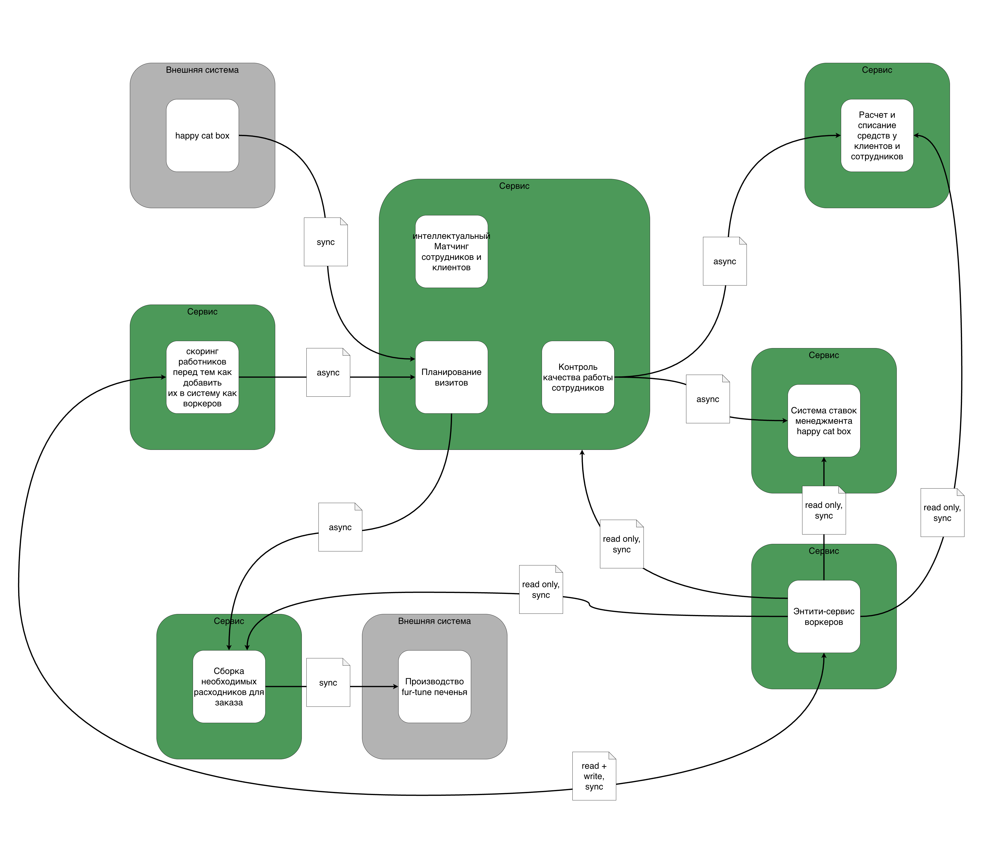
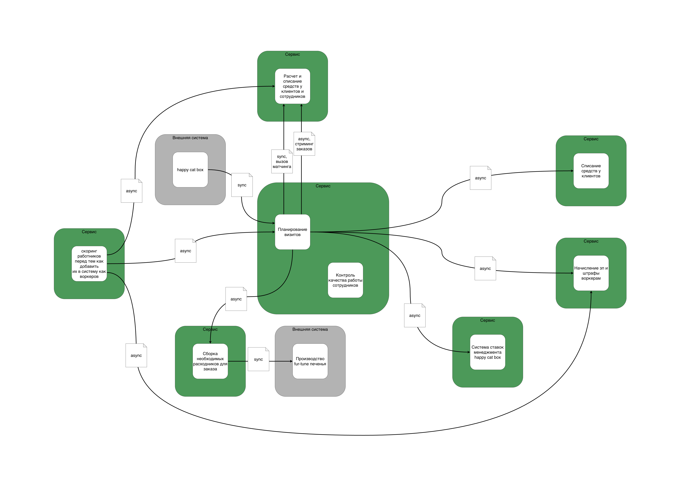

# Домашка 4 недели

> В этом уроке нам необходимо исправить систему, которую сделали до нас. Т. е. надо из «начальной системы» получить то, что у вас получилось в конце третьей домашки.

Структура системы "до" (кого будем рефакторить):

Для сравнения, моя нулевая домашка:  
[0-week homework](../0-week/task.md)

Нулевая домашка у меня хоть и есть, но мне показалось интереснее разобрать ту, которая была предложена в самом ДЗ (Антон, не серчай, если чё).  
В моей нулевой домашке я почему-то забыл про сервис сбора расходников (вместе с печеньками), но в остальном структура похожая, только без Энтити-сервиса. Мне показалось интересным разобрать пример именно с Энтити-сервисом.

Структура системы "после" (целевая):

Для сравнения, моя третья домашка:  
[3rd-week homework](../3-week/task.md)

Мне кажется, суть ровно такая же, только названия поддоменов и контекстов другие.  
В текущей ДЗ использую терминологию, которая дана на исходной модели системы, а не как в моей третьей домашке.

## Как и почему будем изменять структуру системы

> Опишите, какие сервисы и боундед-контексты в каком месте и каким образом будут меняться;

Что вообще нужно сделать:

- "Интеллектуальный Матчинг сотрудников и клиентов" необходимо выделить в отдельный сервис.  
В структуре системы "до" он изображен в одном сервисе с контекстами "Планирование визитов" и "Контроль качества работы сотрудников". Эти два контекста относятся к generic-поддомену компании "Выполнение заказов клиентов", в то время как "Матчинг" относится к core-поддомену "Подбор самого подходящего сотрудника под задачу клиента".  
По этой причине эти контекты обладают различными характеристиками, и контекст, относящийся к core-поддомену необходимо выделить в отдельный сервис (чтобы обеспечить эти характеристики).  

- Контекст "Расчет и списание средств у клиентов и сотрудников" необходимо разделить на два - отдельно для списаний с клиентов, отдельно для начисления зарплаты (и списания штрафов) у воркеров.  
Согласно проведенному ранее маппингу характеристик на контексты, у этих контекстов также есть различия в характеристиках - более высокая modularity у контекста списаний клиентов, + необходимость в отдельных изолированных БД у каждого из контекстов для выполнения требований compliance.  
Поэтому, эти два контекста также должны находиться каждый в своём сервисе.

- Энтити-сервис воркеров необходимо устранить, т.к. он является источником каплинга:  
В структуре системы "до" он является источником данных для нескольких других контекстов.  
В связи с этим, если сломается один из контекстов, который связан с Энтити-сервисом, то от этого может сломаться и сам Энтити-сервис, и как следствие - остальные зависящие от него сервисы.  

  Эту проблему необходимо решить с двух сторон:

  - Во-первых, изменить стиль коммуникаций на асинхронные event-driven, чтобы стримить в зависящие контексты информацию о воркерах.  
  Таким образом, даже если "поставщик" данных о воркере сломается, то зависимый контекст останется работоспособным, пусть и не с наиболее актуальными данными.
  - Во-вторых, чтобы разорвать "лишнюю" связь с контекстом, где данные о воркерах создаются (скоринг работников перед тем как добавить их в систему как воркеров), необходимо объединить энтити-сервис с контекстом Скоринга.  
  Таким образом, контекст "Скоринга" будет продюсить данные о воркерах, а другие контексты - будут собирать данные из брокера.

## Расчет Instability

> Для каждого сервиса который добавится или удалится и связанных с ним сервисов посчитайте значение instability;

> [!IMPORTANT]  
> Instability считался на уже "измененной" системе, т.е. смотрите выше диаграмму "после" рефакторинга.

- Новый сервис "Матчинга":
  - Instability = 0 / (0 + 3) = 0

- Сервис "Скоринга":
  - Instability = 3 / (3 + 0) = 1

- Сервис "Планирование визитов и контроль качества" (только учитывая связи с матчингом):
  - Instability = 2 / (2 + 0) = 1  
  Или, если учитывать вообще **все** связи (см. новую схему) со всеми элементами, то:
  - Instability = 6 / (6 + 2) = 0.75

- Новый сервис "Начисления зп воркерам":
  - Instability = 0 / (0 + 2) = 0

- Сервис "Списание средств у клиентов":
  - Instability = 0 / (0 + 1) = 0

- Удаленный сервис "Энтити-сервис воркеров":
  - Instability = 5 / (5 + 1) = 0.83

## Планы работ по модификации сервисов

> Спланируйте, как и в какой последовательности будет происходить работа. Сделайте два описания, для каждого из условий:
когда есть свободные люди и ресурсы, а опыта и (или) инфраструктуры нет;
когда свободных людей и ресурсов нет, а опыт и (или) инфраструктура есть.

### Есть люди и ресурсы, а (ж)опыта - нет

Делаем сначала новую функциональность, на которой хотим обкатать инфраструктуру.  
Либо, если новых запросов нет, то смотрим на generic-поддомены.

- В таком варианте, наименее рисковый путь - это вынести сервис по начислению зп воркерам, т.к. он относится к generic-поддомену по выполнениюю услуг клиентам.
  - Я бы попробовал в этом случае применить паттерн Tactical Forking.
  - Добавляем новый сервис, переключаем текующую коммуникацию от Энтити-сервиса воркеров на новый сервис.
- Рефакторим существующий сервис расчетов и выплат - удаляем код, связанный с зарплатами воркеров.
  - По-хорошему, в этом рефакторинге нам бы и архитектурный стиль сменить (если был modular или layered monolith, то можно поменять на microkernel для более высокого значения modularity - нужно, чтобы добавлять новые плагины для платежных систем).
- Следующий шаг - переводим коммуникации от Энтити-сервиса воркеров на async event-driven.
  - Пишем консьюмеры для получения информации о воркерах во все нужные сервисы.
  - Пишем продюсер в Энтити-сервисе с воркерами, убеждаемся что инфраструктура работает.
- Если необходимо - переносим все данные о воркерах обратно в сервис "Скоринга".
- Пишем продюсер в сервисе "Скоринга" - теперь он будет посылать события и стримить данные о воркерах, в остальные сервисы.
- Отключаем Энтити-сервис воркеров.
- Последним шагом - выносим контекст "Матчинга" в отдельный сервис.  
  - Если мы будем использовать отдельный вид БД (например, общий сервис использовал реляционную БД, а нам нужна в Матчинге графовая) - тогда будем использовать паттерн CDC. Если нет - то видимо подойдет Strangler Fig pattern (но тут я не уверен).

### Есть (ж)опыт, а больше ничего и нет (людей, ресурсов, котов)

- Я бы начинал с удаления Энтити-сервиса воркеров - тем самым снизим каплинг в большой части системы, улучшим потенциальные проблемы с reliability системы
  - Начинаем с перевода коммуникаций на async event-driven (консюмеры, продюсеры, вот это всё)
  - Затем смерживаем сервис с сервисом "Скоринга сотрудников"
  - Затем удаляем старый Энтити-сервис
- Следующим шагом - выносим "Матчинг" в отдельный сервис
  - Как написано выше, либо CDC, либо ~~Stranger Things~~ Strangler Fig
- Последним - выносим сервис "Начисления зарплат воркерам" при помощи Tactical Forking паттерна
  - В конце - рефакторим сервис "Приема оплаты клиентов"

## Мемас

Эмоции Ибрагима в конце 4 урока:

Спасибо, что прочитали!
