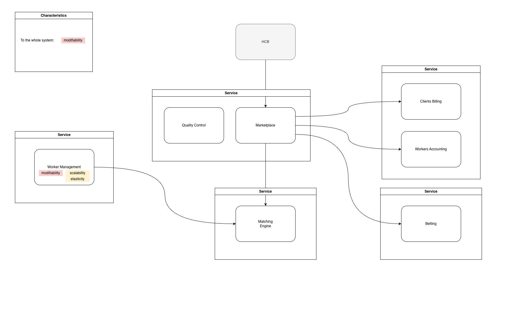
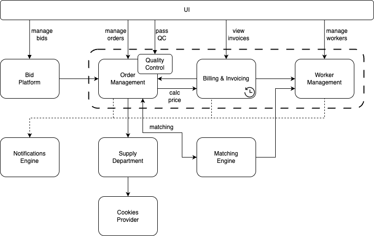
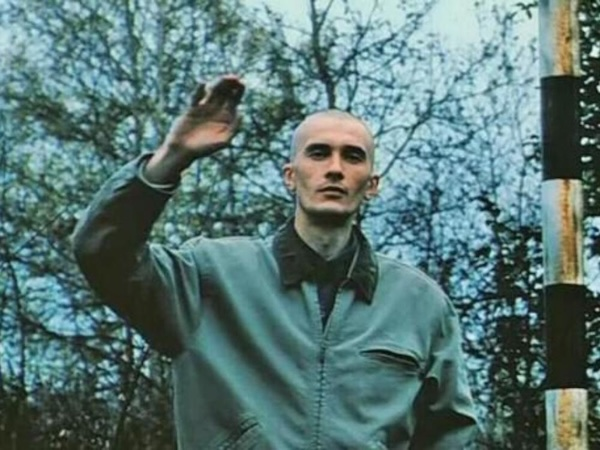

# Домашка 5 недели

> Достать спроектированную систему из нулевой недели и сравнить её с текущим результатом. Найти места, которые вы сделали иначе, чем изначально планировали, что в текущем решении отличается от изначального и что лично вам понравилось из решений.

## Как выглядела система в 0 домашке:

## А как она стала выглядеть после 3 урока:

- Поддомены и Bounded Contexts c характеристиками:

- Сервисы:

- Коммуникации:

На самом деле, как минимум структурно (с точки зрения состава сервисов) - отличия небольшие, на мой взгляд.  
Самое значительное отличие - разделение контекстов _"Биллинга клиентов"_ и _"Биллинга воркеров"_ на два отдельных сервиса.  
В остальном - сервисы такие же, коммуникации тоже +/- совпали (сервис регистрации котов из HCB - не в счет, я согласен с тем, что изображать его на схемах - это косяк, но по-большому счету этот механизм я всегда и рассматривал как часть контекста _"Маркетплейс заявок от клиентов"_).  

Рассуждения о нейминге "Маркетплейса заявок от клиентов"...

Название _"Маркетплейс заявок от клиентов"_ - всё еще бесит; я думаю, что чтобы найти ему имя, есть всего два варианта:

- Либо: Назвать поддомен _"Решение задач клиентов"_ или _"Выполнение поручений клиентов"_, или _"Выполнение работы за клиента"_ (чтобы было похоже на проблему), а bounded context - _"Прием и выполнение заявок клиентов"_ (чтобы было похоже на решение)
- Либо: Назвать bounded context - _"Биржа заявок и исполнителей"_ (т.к. биржа это не проблема, а решение). Чтобы это стало маркетплейсом, должны быть _услуги_, которые будут _покупать_, а не _заявки_, которые надо исполнять, как оно у нас в требованиях.

  

### Почему решения такие похожие?  

На это есть две основные причины:  

1. У меня был куплен курс "Анализ Систем" на тарифе аптечка, и в начале года я начал проходить его самостоятельно (с домашками, ~~и поэтессами~~).  
Самостоятельно успел пройти только 1 и 2 уроки.  
А на самые изначальные попытки нарисовать ES ушли часов 10 работы на отпуске в Тайланде...
2. Многое прояснил курс "Коммуникации Систем", который я прошел перед АС.

Справедливости ради, все домашки (начиная с нулевой) в этом курсе я переделал довольно значительно, так что с каждым прочтением курс давал больше понимания идей.  

Как видно из нулевой домашки, я "что-то помнил" из подхода про характеристики, но не выписал их все, и не замапил толком на отдельные контексты (как раз соответствует тому, что в самостоятельном обучении я остановился перед 3м уроком).

## "Настоящая" нулевая домашка

Самая-самая из нулевых домашек - это та, которую я сделал, перед тем как начал проходить АС самостоятельно, и перед тем как прошел КС.  

Вот она (уберите детей от экранов, я предупреждал):

  

Если вдруг интересно почитать сопроводительный текст, как я объяснил эту структуру, то есть отдельный [документ](personal-task-0-week.md).

Вот она - самая-самая нулевая, до прочтения (и практики) материалов обоих курсов.  
Результат - налицо.

> Выписать идеи и подходы, которые вы хотели бы внедрить в ваших рабочих или других проектах, чтобы мы могли их обсудить и подумать, как лучше всего внедрить каждую из идей или подходов.

- Я бы хотел применять подход по разделению системы на bounded contexts на основе анализа бизнеса (интересен стратегический DDD, до Wardley Mapping я пока не дорос)
- Хотел бы объяснять принятые архитектурные решения на основе характеристик
- С точки зрения реализации - хочу углубиться в архитектурные стили, чтобы реализовывалось так, как задумывалось.

## Курс понравился, спасибо!

PS. 100% буду возвращаться к материалам курса еще не раз - изучить (и уместить его в голову) весь - задачка не из легких.  
А к дополнительным материалам я еще пока вообще не прикасался...
